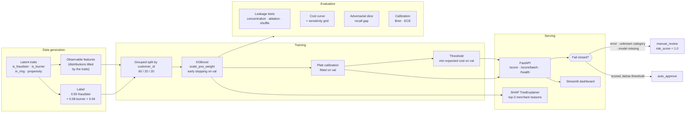

# ARCHITECTURE.md — decision log

Every entry is **decision → why → what was rejected**. These are the choices a panel is
most likely to probe. Numbers quoted here come from `outputs/metrics.json`, regenerated
by `python run.py`.

## System flow

---

## 1. Latent-trait data generation, not feature-conditioned labels

**Decision.** Fraud risk originates in unobserved customer traits (`is_fraudster`,
`is_burner`, ring membership, return propensity). Those traits *tilt the distributions*
that observable features are drawn from, and the label is drawn from the traits. No
feature is modified after the label is realised.

**Why.** The previous generator computed `fraud_prob` from `order_value`, `is_cod`,
`discount_percentage` and `days_to_return`, drew the label, then pushed those same
features further out for the fraud rows. The model was inverting the label formula, not
learning fraud. It reported PR-AUC ~0.95, which collapsed to ~0.32 once those features
were withheld — a 66% relative fall. The current model reports **0.4369** and falls only
**14.5%** under the same ablation.

**Rejected.** (a) Keeping the old generator and simply dropping the leaked features —
that removes the symptom but leaves a generator that cannot produce realistic covariance
between features. (b) Adding noise to the label — masks the leak rather than removing it.

**Deviation from the spec's own example.** `PROJECT_SPEC.md` §6.1 sketches the label as
`0.55·is_fraudster + 0.08·(account_age < 30) + 0.04`. That still places an *observed model
feature* inside the label formula, contradicting the principle §6.1 exists to enforce, and
it plants a sharp discontinuity at day 30 for a tree ensemble to find. Built that way,
`customer_account_age_days` took **27%** of gain importance — over the 25% cap the leakage
test enforces. The age term was replaced with a second latent trait, `is_burner`, which
tilts observed age downward. Every term in the label is now latent. §0.1 explicitly
authorises this: the principle binds, the example code does not.

## 2. `rto_risk_score` rebuilt as a geography signal, not dropped

**Decision.** Keep the field (§5's API contract requires it), but redefine it as the
**historical RTO rate of the delivery pincode** — a statistic the merchant reads off its
own logistics history. Fraud rings cluster geographically, so fraudsters are tilted toward
high-RTO pincodes; that is the only reason it carries signal.

**Why.** In the old design it was a linear recombination of `order_value`, `is_cod` and
`discount` using near-identical thresholds to the label formula — a third restatement of
the leak. The spec offered "drop it or make it genuinely independent". Dropping it would
have broken the API contract; the pincode formulation is genuinely independent of the
other features and is a real signal an Indian merchant actually has.

**Rejected.** Dropping the feature (contract break); keeping the old definition (leak).

## 3. `scale_pos_weight` over SMOTE

**Decision.** Handle the ~12.7% class imbalance by re-weighting the positive class.

**Why.** SMOTE interpolates new minority points between existing ones. On data that is
*already synthetic*, that means synthesising from synthetic — inventing structure twice
over and making any claim about generalisation meaningless. Re-weighting changes the loss,
not the data, so the training distribution stays exactly the one being reasoned about.

**Rejected.** SMOTE/ADASYN (above); undersampling the majority (throws away most of the
33,331 rows for no benefit at this imbalance level).

**Consequence, handled:** `scale_pos_weight` deliberately breaks probability calibration.
See decision 5.

## 4. XGBoost over a neural network

**Decision.** Gradient-boosted trees.

**Why.** 15 tabular features, ~33K rows, heterogeneous scales, and a hard requirement for
per-decision explanations. `TreeExplainer` gives **exact** SHAP values for tree ensembles
in near-constant time — a neural net needs sampling-based approximations that are slower
and noisier, which matters when a merchant ops reviewer sees the reasons on every order.
Trees also handle missing values natively, which the `days_to_return = -1` sentinel
depends on (decision 8).

**Rejected.** An MLP (no accuracy advantage at this size; worse explanations); logistic
regression (would need manual interaction terms and still underperform); a deep tabular
transformer (multiplies complexity and training cost for no gain at 33K rows).

## 5. Platt calibration over isotonic — measured, not assumed

**Decision.** Calibrate with Platt scaling (logistic regression on the log-odds of the raw
score), fitted on the validation fold.

**Why.** Isotonic regression is the standard recommendation for tree ensembles, and it was
tried first and **measured**. Isotonic is only *weakly* monotone — a step function — so it
collapsed 4,187 distinct test scores into 41 levels, tying 4,443 rows. Those ties cost
real ranking quality: PR-AUC fell from **0.4488 to 0.4353**. It also emitted exactly `1.0`
for a few rows, colliding with the fail-closed sentinel (decision 7). Platt is *strictly*
monotone: no ties, PR-AUC and ROC-AUC preserved exactly, and it calibrated slightly better
anyway (Brier **0.09354** vs **0.09419**). Strictly better on every axis.

**Result.** Brier **0.16336 → 0.08805**, ECE **0.2647 → 0.0142**. The calibrated Brier also
beats the base-rate-constant floor (0.11063), so the score is a genuinely useful
probability rather than just a ranking.

**Rejected.** Isotonic (above); no calibration at all (raw `scale_pos_weight` outputs are
systematically inflated, so a "risk score" would not mean anything on the 0–1 axis).

## 6. Three-way grouped split, not the two-way split in the spec snippet

**Decision.** 60/20/20 train/validation/test, **grouped by `customer_id`** via
`GroupShuffleSplit`. Early stopping and threshold selection use validation only; the test
set is scored once at the end.

**Why.** Two independent problems.
*(a)* §6.2's snippet passes the test set as `eval_set`, so early stopping selects the tree
count that looks best on the test set — the reported metric is then optimistic by
construction.
*(b)* A customer contributes several return requests, and customer-level features
(return-rate history, account age, ring membership) are near-constant within a customer. A
row-wise split puts the same customer on both sides and lets the model memorise
individuals — a second, subtler leak of the same family as decision 1.

**Rejected.** Row-wise `train_test_split` (leaks customers); k-fold CV (unnecessary at this
sample size and complicates the single-use test discipline).

## 7. Fail-closed everywhere, with `1.0` reserved as the sentinel

**Decision.** Exactly one path reaches `auto_approve`: a fully-parsed order whose model
score came back below the threshold. Everything else — unrecognised category, missing
model, any exception — returns `risk_score = 1.0` and `manual_review`. Model-derived
scores are clamped to a maximum of **0.999**.

**Why.** The failure that matters in fraud detection is approving something you could not
assess. An unknown category used to be mapped to encoded index `0`, silently impersonating
whichever category sorted first ("Apparel") and producing a confident, approvable score
for an input the model had no basis to judge. Reserving `1.0` keeps "the model is certain
this is fraud" distinguishable from "we could not score this at all" — two states needing
very different downstream handling that a shared `1.0` would conflate.

**Rejected.** Returning HTTP 500 on unknown category (a merchant adding a catalogue
category deserves a safe, reviewable answer, not an integration error); defaulting to the
most common category (the original bug).

## 8. `days_to_return = -1` maps to NaN, not to a number

**Decision.** The contract's "unknown" sentinel becomes `NaN` and is routed by XGBoost's
native missing-value handling. The response carries a `data_quality_notes` entry.

**Why.** Feeding `-1` as a literal value places it below every value the model ever saw,
so the tree treats "unknown" as "returned extremely promptly" — which reads as **low**
risk. That is precisely the wrong direction for a missing-data case.

**Rejected.** Imputing the mean (invents a specific, confident value); forcing every such
request to `manual_review` (too aggressive — it would route every partially-integrated
merchant's entire volume to human review).

## 9. Cost assumptions: FP ≈ ₹50, FN ≈ ₹500 — illustrative, and stress-tested

**Decision.** Publish the reasoning chain, then show how much the conclusion depends on it.

- **FN ≈ ₹500** — a fraudulent return approved: unrecovered cost-of-goods on a
  mid-value order (~₹380, against a measured mean order value of ₹2,049 at typical D2C
  margins) + reverse logistics (~₹80) + support handling (~₹40).
- **FP ≈ ₹50** — a genuine return sent to review: ~8 minutes of an ops reviewer at a
  fully-loaded ~₹300/hour (~₹40) + a goodwill/friction allowance.

**Why publish the chain.** The 10:1 ratio drives the entire operating point. Asserting it
is not defensible; showing it, and showing what happens when it is wrong, is.
`evaluate/sensitivity.py` re-optimises across FN:FP ratios from 2× to 50×. The threshold
chosen under 10× carries **0% regret** at 10×, **6.8%** at 5×, **7.6%** at 20× — but
**45%** at 2× and **107%** at 50×. The honest statement: this operating point is robust to
being wrong by about 2× in either direction, and not beyond.

**Also relevant:** the cost curve is flat. Any threshold in **[0.079, 0.144]** lands within
5% of minimum cost, so the exact cut-off is a review-capacity decision, not a number the
model must nail.

**Rejected.** A single asserted threshold with no sensitivity analysis; claiming precision
on cost figures that no public source supports.

## 10. Approve-all as the baseline, not a random classifier

**Decision.** Report cost reduction against **approve-all** (₹63.34/return): every
fraudulent return approved, nobody legitimate inconvenienced.

**Why.** A merchant's real alternative to this system is doing nothing, not deploying a
random classifier. Review-all (₹43.67/return) is also reported for merchants who already
review everything. Measured result: **₹27.87/return, 56.0% below approve-all**.

**Rejected.** A random or majority-class baseline (flatters the model and answers a
question nobody asked).

## 11. Defense-only: what is deliberately *not* exposed

**Decision.** No endpoint returns global feature importances, the decision surface, or a
counterfactual ("what would make this approve"). `/health` reports
`threshold_configured: true` rather than the threshold value. Batches are capped at 100
orders and `/score*` is rate-limited to 120 requests/minute per client.

**Why.** Track 02 disqualifies anything offense-capable. Constraint §1.1 forbids revealing
exact thresholds "beyond what's needed to act on a single legitimate order" — `/health` is
an unauthenticated liveness probe, not an act on an order, so a global threshold there is
disclosure with no operational justification. This is a **deliberate deviation from §6.5's
example snippet**, which puts `threshold` in the health body. `/score` *does* return
`threshold_used`, which sits inside that carve-out: the merchant needs it to interpret the
one order they asked about, and it reveals nothing an attacker could not already compute
from the `risk_score` + `action` pair in the same response.

**Rejected.** Returning the threshold on `/health` (§6.5's literal snippet); uncapped batch
scoring (the cheapest way to map a decision boundary); a "why was this flagged and what
would change it" endpoint (directly evasion-enabling). See `SAFETY.md`.

## 12. `is_prepaid` accepted but excluded from the model

**Decision.** The API accepts all 16 contract fields and validates
`is_prepaid + is_cod == 1`, but the model trains on 15 features — `is_prepaid` is omitted.

**Why.** It is definitionally `1 - is_cod`. Feeding a perfectly collinear duplicate lets
the booster split importance arbitrarily across the pair, which would weaken the
per-feature importance cap the leakage test enforces. Keeping it in the contract as a
consistency cross-check is more useful than feeding it: a payload asserting both or
neither is internally contradictory, has no safe interpretation, and is rejected with a
422 (still fail-closed — a 422 can never produce an `auto_approve`).

**Rejected.** Feeding both (redundancy pollutes importance); dropping it from the contract
(a silent, unannounced API change).
