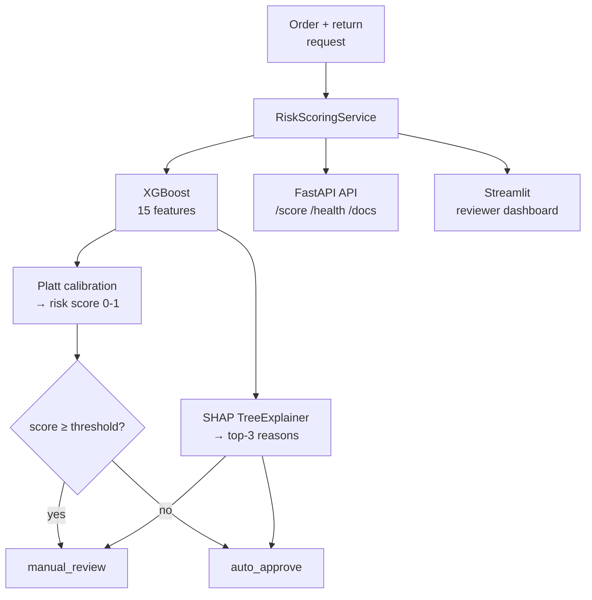

# 🛡️ Return Risk Scorer

**Defense-only return-fraud risk scoring for Indian e-commerce.**  
Given an order and a return request, it returns a calibrated risk score (0–1), a bounded
action (`auto_approve` / `manual_review`), and the top-3 human-readable reasons — and it
ships with an automated test suite that proves the model is not cheating via label leakage.

> Razorpay AI Buildathon 2026 · **Track 02: AI Risk Manager**

[](https://github.com/udaytripathi51/return_risk_scorer/actions/workflows/ci.yml)
[](https://www.python.org/)
[](https://return-risk-dashboard.onrender.com)
[](https://return-risk-scorer-kw0n.onrender.com)
[](#license)

---

## 🚀 Live Demo

### Streamlit Dashboard

**Live application:** https://return-risk-dashboard.onrender.com

### FastAPI API

**Live API:** https://return-risk-scorer-kw0n.onrender.com

### API Documentation

**Swagger UI:** https://return-risk-scorer-kw0n.onrender.com/docs

### Health Check

**API health:** https://return-risk-scorer-kw0n.onrender.com/health

---

## Results

Held-out test set: **6,686** return requests (a customer-grouped 20% slice of 33,331
generated), **12.67%** fraud base rate. Every number is regenerated by `python run.py`
and written to `outputs/metrics.json`.

| Metric | Value | |
|---|---|---|
| **PR-AUC** | **0.4369** | **3.45× lift** over the 0.1267 no-skill baseline |
| ROC-AUC | 0.8019 | |
| Precision / Recall | 0.280 / 0.754 | at the cost-optimal operating point |
| **Cost per return** | **₹27.87** | vs **₹63.34** approve-all → **56.0% lower** |
| Brier score | 0.0881 | from 0.1634 raw; base-rate constant is 0.1106 |
| Expected calibration error | 0.0142 | from 0.2647 raw |
| Adversarial recall gap | 0.754 → **0.331** | **−56.2%** against an adapted abuser |

### Why PR-AUC is 0.44 and not 0.95

Because 0.95 was a lie. The earlier version of this project built its fraud label *from*
`order_value`, `is_cod`, `discount_percentage` and `days_to_return`, then made those same
features more extreme for the rows that came up fraudulent. The model was reverse-
engineering the label formula. Withhold those columns and it collapsed to ~0.32.

The generator was rebuilt so that risk originates in **latent, unobservable customer
traits** that only *tilt the distributions* observable features are drawn from — and
nothing is rewritten after the label is drawn. PR-AUC **0.4369 against a 12.7% base rate
is a real 3.45× lift**, and it survives having its top features taken away:

| Leakage check | Result | Limit |
|---|---|---|
| Max single-feature importance | **19.3%** (`customer_return_rate_lt`) | ≤ 25% |
| PR-AUC after dropping top-3 features | 0.4369 → **0.3734** (−14.5%) | ≤ 50% |
| PR-AUC on shuffled labels | 0.1187 vs 0.1267 base rate (0.94×) | ≤ 1.25× |

The pre-fix model fell **66%** under that same ablation. This one falls 14.5%. These run
in CI on every push (`tests/test_leakage.py`), so the fix cannot silently regress.

---

## Quickstart

```bash
git clone https://github.com/udaytripathi51/return_risk_scorer.git
cd return_risk_scorer
pip install -r requirements-lock.txt
python run.py
```

`run.py` generates data, trains, evaluates, and writes `outputs/` plus
`models/MODEL_CARD.md`. It takes about a minute on a laptop CPU.

**Serve the API:**

```bash
uvicorn api.app:app --port 7860
```

**Score the bundled example:**

```bash
curl -X POST http://localhost:7860/score -H "Content-Type: application/json" -d @sample_order.json
```

### Representative response

```json
{
  "risk_score": 0.8066,
  "action": "manual_review",
  "reasons": [
    {
      "reason": "Account is only 18 days old",
      "contribution": 0.7149,
      "direction": "increases_risk"
    },
    {
      "reason": "Returns 62% of lifetime orders, above the ~12% norm",
      "contribution": 0.3956,
      "direction": "increases_risk"
    },
    {
      "reason": "3 other returns from this address in 7 days -- possible ring",
      "contribution": 0.3666,
      "direction": "increases_risk"
    }
  ],
  "threshold_used": 0.0994,
  "model_version": "rrs-..."
}
```

<sub>`threshold_used` is shown rounded here; the API returns the full float. `contribution`
is a SHAP value in the model's raw log-odds margin space — deliberately *not* on the same
scale as `risk_score`.</sub>

**Run the demo dashboard:**

```bash
streamlit run dashboard/app.py
```

The dashboard provides three tabs:

1. **Score one order** — manual entry, risk score, top-3 reasons, SHAP waterfall, and cost-curve position.
2. **Score a CSV batch** — upload, triage table, and downloadable results.
3. **Model evidence** — leakage checks, calibration, adversarial performance, and cost sensitivity.

**Run the tests, including the leakage suite:**

```bash
pytest tests/ -v
```

---

## How it works



**In words:** hidden customer traits → tilted feature distributions → a label drawn from
the traits → XGBoost trained on a split that keeps each customer wholly on one side →
calibrated to real probabilities → thresholded at minimum expected cost → explained with
SHAP → exposed through the FastAPI API and the Streamlit reviewer dashboard using the same
`RiskScoringService` implementation.

**Fail-closed by construction.** There is exactly one route to `auto_approve`: a fully-
parsed order whose model score came back below the threshold. Unknown category, missing
model, or any exception → `manual_review`. Breaking the scorer sends everything to a
human, which is the safe direction.

### The five signals it actually uses

Feature importance is spread, not concentrated — which is the point:

| Feature | Gain importance |
|---|---|
| `customer_return_rate_lt` | 19.3% |
| `same_address_returns_7d` | 15.8% |
| `customer_account_age_days` | 11.3% |
| `customer_order_velocity_7d` | 8.9% |
| `same_email_returns_7d` | 8.5% |

Return history, ring-collision signals and account tenure — not order value or COD flag,
which is exactly what the pre-fix model leaned on because the label was built from them.

---

## What makes this submission different

1. **An automated leakage test, not a promise.** Three checks — importance concentration,
   top-3 ablation, and a shuffled-label control — run in CI on every push. The
   shuffled-label control is the one people skip: it proves the *pipeline* (split,
   encoding, calibration) isn't leaking, independently of the data.

2. **Honest metrics, including the unflattering one.** The adversarial recall gap
   (−56.2%) is published in the model card. An adapted abuser who suppresses ring
   collisions and keeps return history normal *does* evade this model, and a merchant
   deciding how much to trust auto-approve needs that number.

3. **Cost assumptions that are stress-tested, not asserted.** FP ≈ ₹50 / FN ≈ ₹500 comes
   with a reasoning chain *and* a sensitivity grid across FN:FP ratios from 2× to 50×.
   The operating point is robust to being wrong by ~2×; beyond that it isn't, and the
   regret is quantified.

4. **Calibration chosen by measurement.** Isotonic was tried first and rejected: its step
   function tied 4,443 rows together and cost 3% of PR-AUC. Platt is strictly monotone,
   preserves ranking exactly, and calibrated better.

5. **Defense-only, verifiably.** No feature-importance endpoint, no counterfactual API, no
   global threshold on `/health`, batch capped at 100, rate-limited. See
   [SAFETY.md](SAFETY.md).

---

## API

| Endpoint | Purpose |
|---|---|
| `GET /` | Service metadata |
| `GET /health` | Liveness/readiness — **503** when the model isn't loaded |
| `POST /score` | Score one return request |
| `POST /score/batch` | Score up to 100 (capped deliberately — see SAFETY.md) |
| `GET /docs` | OpenAPI / Swagger UI |

### Live API

**Base URL:** https://return-risk-scorer-kw0n.onrender.com

**Swagger UI:** https://return-risk-scorer-kw0n.onrender.com/docs

**Health check:** https://return-risk-scorer-kw0n.onrender.com/health

Request fields are documented in [`api/schemas.py`](api/schemas.py).

---

## Deployment

The project is deployed publicly on Render as two separate Web Services.

### FastAPI API

- **Runtime:** Docker
- **Public API:** https://return-risk-scorer-kw0n.onrender.com
- **Health check:** `/health`
- **Swagger UI:** https://return-risk-scorer-kw0n.onrender.com/docs

### Streamlit Dashboard

- **Runtime:** Python 3.13
- **Build command:** `pip install -r requirements-lock.txt`
- **Start command:** `streamlit run dashboard/app.py --server.address 0.0.0.0 --server.port $PORT`
- **Public dashboard:** https://return-risk-dashboard.onrender.com

Both services use the project's persisted model artifacts and the same `RiskScoringService`
implementation. The Streamlit dashboard runs the scoring service directly rather than
making HTTP requests to the FastAPI deployment.

---

## Documentation

| Document | What's in it |
|---|---|
| [PROJECT_GUIDE.md](PROJECT_GUIDE.md) | Setup, deployment, submission walkthrough, video plan, and panel questions |
| [ARCHITECTURE.md](ARCHITECTURE.md) | 12 decisions as decision → why → what was rejected |
| [SAFETY.md](SAFETY.md) | Defense-only rationale; what is and isn't exposed |
| [models/MODEL_CARD.md](models/MODEL_CARD.md) | Auto-generated metrics and limitations |
| `outputs/` | Cost curve, sensitivity grid, reliability diagram, `metrics.json` |
| Live Dashboard | [Streamlit application](https://return-risk-dashboard.onrender.com) |
| Live API | [FastAPI service](https://return-risk-scorer-kw0n.onrender.com) |
| API Docs | [Swagger UI](https://return-risk-scorer-kw0n.onrender.com/docs) |

---

## Honest limitations

- **The data is synthetic.** There is no real, public, India-specific return-fraud dataset
  — every public "return prediction" dataset is explicitly synthetic, generic (not
  fraud-labelled), or not India-specific. Absolute metrics reflect the generator's
  assumptions. The *relative* claims (leak removed, importance spread, graceful ablation)
  transfer; the absolute PR-AUC will not.
- **Cost figures are illustrative.** A real merchant must substitute their own.
- **IEEE-CIS feature validation: `not_validated`.** It requires a Kaggle account and
  competition-rule acceptance. `scripts/download_ieee.py` makes it runnable, and until it
  runs the model card says `not_validated` — never a pass. (An earlier version returned a
  hardcoded all-`True` result here, making an unrun check look validated.)
- **Adapted abusers evade this model materially** (−56.2% recall). Published, not hidden.
- **No demographic fairness audit.** The generator has no demographic attributes, so one
  would be vacuous here; a real deployment must run one.

---

## License

MIT.