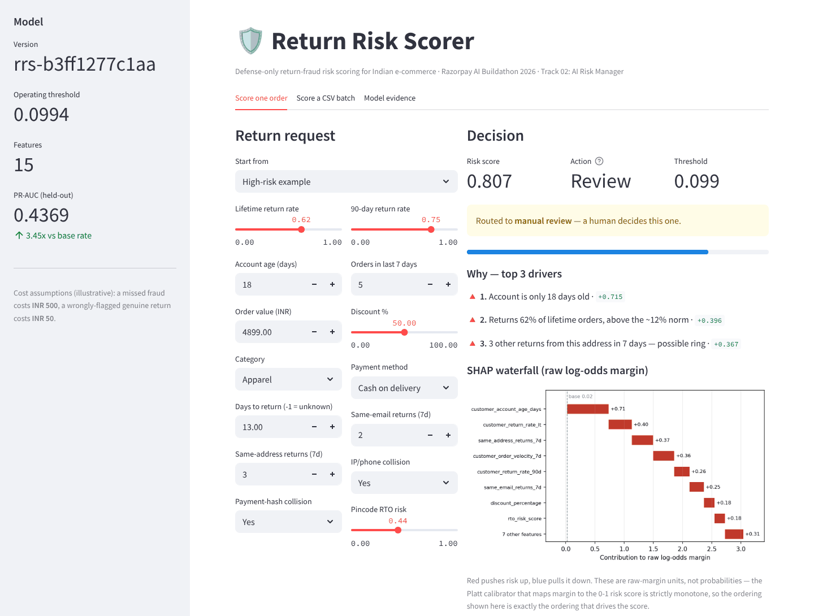
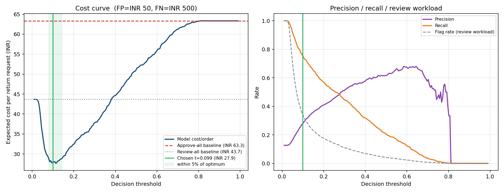
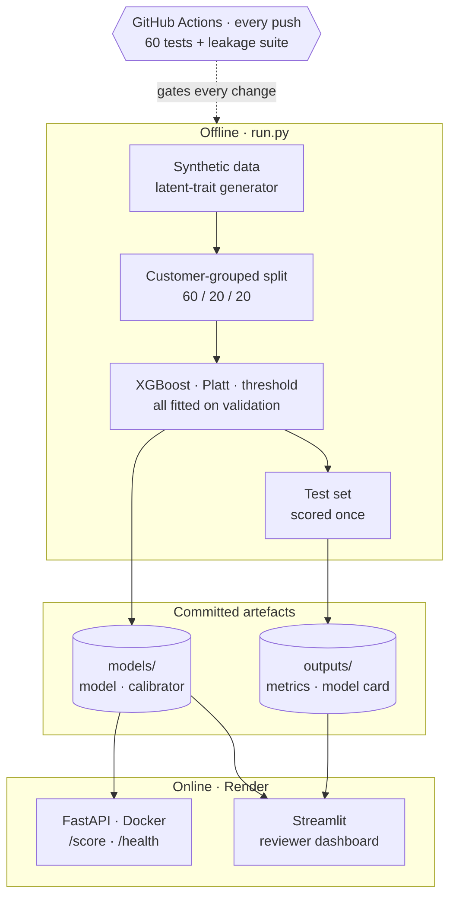
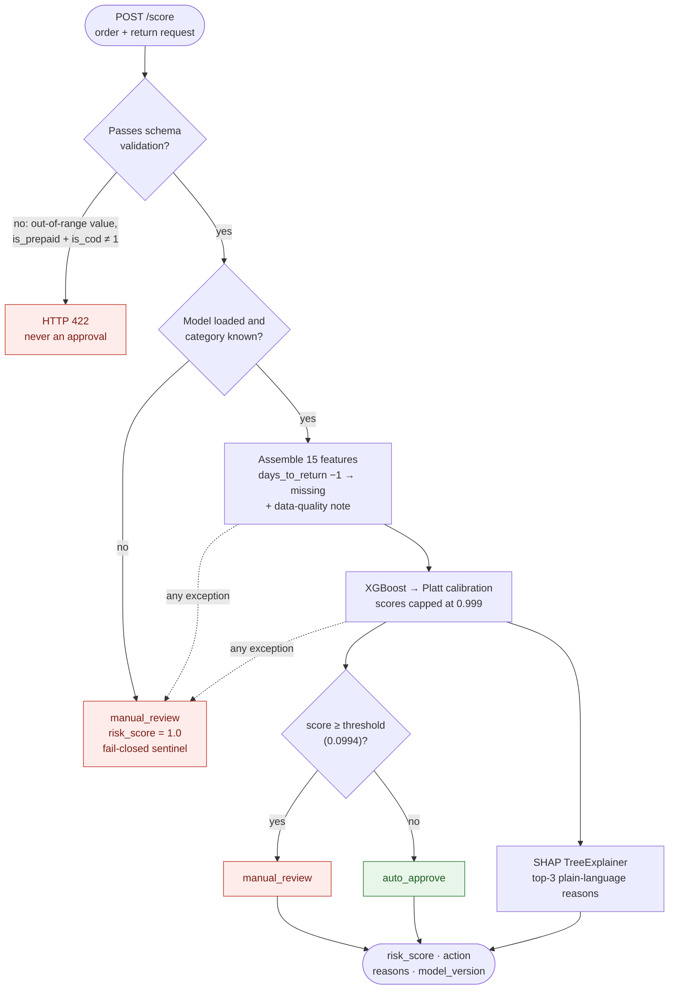
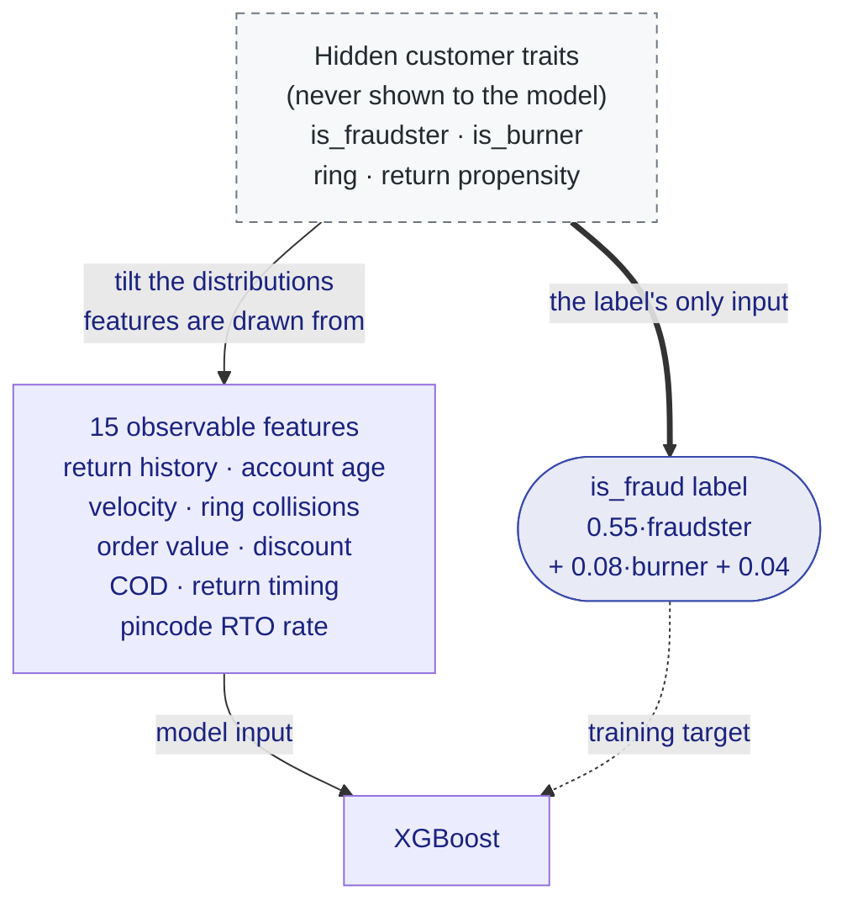

# 🛡️ Return Risk Scorer

**Defense-only, fail-closed return-fraud risk scoring for Indian e-commerce.**  
Every return request gets a calibrated fraud probability, a bounded decision
(`auto_approve` / `manual_review`) and the three reasons behind it. A FastAPI service and
a Streamlit reviewer dashboard serve the same model, and a label-leakage test suite runs
in CI on every push to keep the headline metrics honest.

> Built for the Razorpay AI Buildathon 2026 · **Track 02: AI Risk Manager**

[](https://github.com/udaytripathi51/return_risk_scorer/actions/workflows/ci.yml)
[](https://www.python.org/)
[](https://return-risk-dashboard.onrender.com)
[](https://return-risk-scorer-kw0n.onrender.com/docs)
[](LICENSE)



## Try it live

| What | Link |
|---|---|
| **Dashboard** (Streamlit) | https://return-risk-dashboard.onrender.com |
| **API docs** (Swagger UI: open `POST /score`, then *Try it out*) | https://return-risk-scorer-kw0n.onrender.com/docs |
| **API health check** | https://return-risk-scorer-kw0n.onrender.com/health |

Both services run on Render's free tier, which sleeps after 15 minutes without traffic.
The first request after a quiet spell takes about a minute while the service wakes.

---

## The problem

Returns are where Indian e-commerce quietly loses margin. Cash-on-delivery orders and
return-to-origin shipments make every return expensive, and return abuse ranges from
serial returners to throwaway accounts and rings that share addresses, phones and payment
instruments. A merchant has two bad defaults: approve every return and absorb the abuse,
or review every return and pay in reviewer time and in friction for genuine customers.

Return Risk Scorer sits between the two. It auto-approves the clearly genuine requests and
routes the risky ones to a human, with the reasons attached, at the threshold that
minimises expected cost.

## Results

Held-out test set: **6,686** return requests from customers the model never saw in
training (a customer-grouped 20% slice of 33,331), **12.67%** fraud base rate.

| Metric | Value | |
|---|---|---|
| **PR-AUC** | **0.4369** | **3.45× lift** over the 0.1267 no-skill baseline · 87% of the 0.50 ceiling |
| ROC-AUC | 0.8019 | |
| Precision / Recall | 0.280 / 0.754 | at the cost-optimal operating point |
| **Expected loss per return** | **₹27.87** | vs **₹63.34** approve-all → **56.0% lower** |
| Review workload | 34.2% of returns | flagged for manual review |
| Brier score | 0.0881 | from 0.1634 raw; a base-rate constant scores 0.1106 |
| Expected calibration error | 0.0142 | from 0.2647 raw |
| Adversarial recall | 0.754 → **0.331** | against an adapted abuser, measured and published |
| Latency | ~3.4 ms median | per order, including SHAP reasons (in-process, 2-vCPU Linux) |

Per 10,000 return requests that is 956 fraudulent returns caught, 311 missed and 3,419 sent
to review, at illustrative costs of ₹500 per missed fraud and ₹50 per review. Numbers come
from [`outputs/metrics.json`](outputs/metrics.json), which `python run.py` regenerates, and
the [model card](models/MODEL_CARD.md) is generated from the same file.



### Why 0.44 is the right number

The label is drawn from hidden customer traits, and 29% of fraud labels come from customers
without the fraudster trait, which no feature can predict. An oracle that sees the hidden
traits therefore tops out at PR-AUC **0.50**; this model reaches **0.437**, 87% of that
ceiling. On data like this, a PR-AUC near 0.95 would not be skill. It would be label
leakage, and the project keeps a deliberately leaky dataset around to prove its test suite
catches exactly that ([below](#the-label-cannot-leak-and-ci-proves-it)).

---

## How it works

### System overview



Training, calibration and threshold selection never see the test set; it is scored once,
at the end. Both online services load the same committed artefacts through the same
`RiskScoringService`, and `/health` reports the model's content hash (`model_version`), so
anyone can check which model is live.

### One request, end to end: fail-closed by construction



There is exactly one route to `auto_approve`: a fully parsed order whose calibrated score
came back below the threshold. An unknown category, a missing model or any exception sends
the request to a human, so breaking the scorer can only ever make it more cautious. Model
scores stop at 0.999, which keeps "the model is sure this is fraud" distinguishable from
"this could not be scored" (exactly 1.0).

### The label cannot leak, and CI proves it



The label is built only from hidden traits. Observable features are noisy evidence about
those traits, drawn from overlapping distributions, and never ingredients of the label, so
the model has to infer fraud rather than reverse-engineer a formula. The
leakage suite turns that into a tested property, and it is checked in both directions: the
project data must pass, and a deliberately leaky copy of it (label computed from order
value, COD, discount and return timing) must fail.

| Leakage check | Project data | Leaky control | Limit |
|---|---|---|---|
| Max single-feature importance | **19.2%** (`customer_return_rate_lt`) ✅ | ~45% ❌ | ≤ 25% |
| PR-AUC after dropping the top-3 features | 0.4369 → 0.3734 (**−14.5%**) ✅ | ~0.96 → ~0.23 (**−76%**) ❌ | drop ≤ 50% |
| PR-AUC on shuffled labels | 0.1187 vs 0.1267 base rate (0.94×) ✅ | — | ≤ 1.25× base |

<sub>Project-data figures are the committed run (`outputs/metrics.json`); leaky-control figures
come from `python -m evaluate.leakage_test` and vary slightly by platform.</sub>

---

## Engineering decisions

| Decision | Why it matters |
|---|---|
| **Customer-grouped 60/20/20 split** | No customer spans two splits, so the model cannot memorise individuals. Early stopping, calibration and the threshold all use validation; the test set is scored once. |
| **`scale_pos_weight`, not SMOTE** | Re-weights the loss instead of inventing synthetic points from synthetic data. |
| **Platt over isotonic, measured** | Isotonic collapses 6,684 distinct scores into 50 levels, costs 3.8% of PR-AUC and lands 10 rows on the 1.0 sentinel. Platt preserves ranking exactly and calibrates better (Brier 0.08805 vs 0.08881). Re-measured on every run. |
| **Threshold from expected cost, stress-tested** | Missed fraud ≈ ₹500, unnecessary review ≈ ₹50. Re-optimised across 2×–50× cost ratios; any threshold in [0.079, 0.144] is within 5% of the optimum. |
| **XGBoost, against measured baselines** | Logistic regression scores 0.437 on this data, level with the booster. Trees are kept for native missing-value routing, exact TreeSHAP and headroom for real-world interactions. |
| **SHAP reasons in merchant language** | "3 other returns from this address in 7 days", not "same_address_returns_7d = 3". Descriptive only: no reason ever says how to flip the decision. |
| **Defense-only API surface** | No feature-importance or counterfactual endpoint, no global threshold on `/health`, batches capped at 100, 120 requests per minute per client. See [SAFETY.md](SAFETY.md). |

All twelve decisions, each with what was rejected and why, are in
[ARCHITECTURE.md](ARCHITECTURE.md).

### Compared to what?

`python -m evaluate.diagnostics` (under a minute on a laptop) puts the headline numbers in
context and writes `outputs/diagnostics.json`.

| Question | Answer |
|---|---|
| What is the best any model could do here? | An oracle that sees the hidden traits scores PR-AUC **0.50**. The model reaches **87%** of that. |
| Would a simpler model do? | Logistic regression **0.437**, random forest **0.438**, unweighted XGBoost **0.443**: on this generator the signal lives in the features, not the learner. |
| Would hand-written rules do? | "Lifetime return rate ≥ 30%, or any same-address return this week, or an account under 30 days" costs ₹33.46 per return (47% below approve-all), against the model's ₹27.87 (56%). |
| How stable are the numbers? | Customer-level bootstrap, 95% CI: PR-AUC 0.40–0.48, recall 0.72–0.79, cost reduction 52–60%. Across five generator seeds PR-AUC is 0.43 ± 0.01. |

### The signals it relies on

| Feature | Gain importance |
|---|---|
| `customer_return_rate_lt` | 19.2% |
| `same_address_returns_7d` | 15.8% |
| `customer_account_age_days` | 11.3% |
| `customer_order_velocity_7d` | 8.9% |
| `same_email_returns_7d` | 8.5% |

Importance is spread across return history, ring signals and account tenure, which is how
behavioural fraud evidence looks. Gain rewards features with a few large splits, so it
flatters the ring signals; ranked by mean |SHAP| the order is return rate, account age,
order velocity, discount and days-to-return. `evaluate/diagnostics.py` prints gain, total
gain, SHAP and permutation importance side by side.

---

## Quality gates

- **CI on every push and pull request** ([workflow](.github/workflows/ci.yml)): 60 tests
  covering the API contract, every fail-closed path, model and data properties, and the
  leakage suite in both directions, plus the full-size leakage run.
- **Locked, reproducible builds:** Docker, Render and CI all install from
  `requirements-lock.txt`, on the Python version in `.python-version`.
- **One model everywhere:** the API image and the dashboard serve the committed, hashed
  artefacts; `/health` and the dashboard sidebar both show `model_version`
  `rrs-b3ff1277c1aa`.
- **Regenerated, not hand-written, metrics:** `python run.py` rebuilds `metrics.json`, the
  plots and the model card in about a minute.

---

## Quickstart

Python 3.13 is what the lock file was produced with.

```bash
git clone https://github.com/udaytripathi51/return_risk_scorer.git
cd return_risk_scorer
pip install -r requirements-lock.txt
python run.py                     # data → train → evaluate → outputs/ + model card
```

`run.py` overwrites the committed model. Retraining on another OS or CPU gives slightly
different numbers (a Linux run with the same seed gives PR-AUC 0.4367), because XGBoost's
floating-point training arithmetic is not bit-identical across platforms.

```bash
uvicorn api.app:app --port 7860   # API; Swagger UI at http://localhost:7860/docs
streamlit run dashboard/app.py    # reviewer dashboard
pytest tests/ -v                  # 60 tests, including the leakage suite
```

Score the bundled example (in Windows PowerShell, type `curl.exe` instead of `curl`):

```bash
curl -X POST http://localhost:7860/score -H "Content-Type: application/json" -d @sample_order.json
```

```json
{
  "risk_score": 0.8066,
  "action": "manual_review",
  "reasons": [
    {"reason": "Account is only 18 days old", "contribution": 0.7149, "direction": "increases_risk"},
    {"reason": "Returns 62% of lifetime orders, above the ~12% norm", "contribution": 0.3956, "direction": "increases_risk"},
    {"reason": "3 other returns from this address in 7 days -- possible ring", "contribution": 0.3666, "direction": "increases_risk"}
  ],
  "threshold_used": 0.0994,
  "model_version": "rrs-b3ff1277c1aa"
}
```

<sub>Abridged: each reason also carries its `feature` and `value`, and the response ends with
`data_quality_notes`. `threshold_used` is shown rounded. `contribution` is a SHAP value in
the model's raw log-odds margin, deliberately not on the same scale as `risk_score`.</sub>

The dashboard has three tabs: **Score one order** (inputs, decision, top-3 reasons, SHAP
waterfall, position on the cost curve), **Score a CSV batch** (up to 100 requests, or a
built-in synthetic sample, with a downloadable triage queue) and **Model evidence**
(leakage checks, calibration, adversarial slice, cost sensitivity).

---

## API

| Endpoint | Purpose |
|---|---|
| `GET /` | Service metadata |
| `GET /health` | Liveness and readiness: **503** when the model isn't loaded; reports `model_version` |
| `POST /score` | Score one return request |
| `POST /score/batch` | Score up to 100 requests; each one fails closed independently |
| `GET /docs` | OpenAPI / Swagger UI |

Request fields are documented in [`api/schemas.py`](api/schemas.py) and on the live
[Swagger UI](https://return-risk-scorer-kw0n.onrender.com/docs). Identity signals arrive as
pre-hashed collision flags, never raw emails, phone numbers, cards or IP addresses.

## Deployment

| Service | Runtime | Settings |
|---|---|---|
| **API** | Docker ([`Dockerfile`](Dockerfile)) | Serves the committed `models/` artefacts, with no training in the image. Listens on `$PORT`. Health check path `/health`. |
| **Dashboard** | Python 3.13 (`.python-version`) | Build `pip install -r requirements-lock.txt` · Start `streamlit run dashboard/app.py --server.address 0.0.0.0 --server.port $PORT` |

Both redeploy automatically on every push to `main`. The deployment checklist is in
[PROJECT_GUIDE.md](PROJECT_GUIDE.md).

## Repository layout

```text
api/          FastAPI app, request/response schemas, fail-closed scoring service
dashboard/    Streamlit reviewer UI (same scoring service, in-process)
data/         latent-trait generator, adversarial slice, optional real-data grounding
models/       training, SHAP explainer, committed artefacts, model card
evaluate/     metrics, calibration, cost curve, sensitivity, leakage suite, diagnostics
tests/        60 tests: API contract, fail-closed paths, model and data, leakage suite
outputs/      metrics.json and the evaluation plots
scripts/      optional Kaggle downloads for the real-data checks
run.py        end-to-end pipeline: data → train → evaluate → model card
Dockerfile    API image
```

---

## Scope and production roadmap

| Area | In this project | Next step for production |
|---|---|---|
| **Data** | Synthetic, from a documented generative model: no public, India-specific, fraud-labelled returns dataset exists. Relative claims (no leak, spread importance, graceful ablation) transfer; absolute PR-AUC will not. | Retrain on merchant history, keeping the leakage suite as a release gate. |
| **Real-data grounding** | Olist calibration and IEEE-CIS feature validation are wired in (`scripts/download_*.py`) and reported explicitly; the committed model was trained without them (`not_calibrated`, `not_validated`). | Run both before a real deployment. |
| **Costs** | ₹500 per missed fraud and ₹50 per review are reasoned, illustrative figures, with a sensitivity grid. | Use the merchant's own cost of goods, logistics and review cost; scale the miss cost per order. |
| **Adapted abusers** | Recall falls from 0.754 to 0.331 on an adversarial slice that suppresses ring and burner signals. | Add signals that are costly to fake (device graph, address normalisation), monitor drift, retrain on reviewer outcomes. |
| **Fairness** | COD orders are flagged more often (41% vs 29% of prepaid); the generator has no demographic attributes. | Audit outcomes across payment method, region and income proxies before go-live. |
| **Missing timing** | An unknown `days_to_return` follows XGBoost's default branch (scored like a late return, the cautious side) and is flagged in `data_quality_notes`. | Train with realistic missingness so the branch is learned. |
| **Serving** | In-process rate limiter, CPU-bound scoring on the event loop, row-by-row batches, no authentication. | Gateway rate limits and API keys, a worker pool, vectorised batch scoring. |
| **Demo surface** | The public dashboard lets anyone vary an order's inputs, on synthetic data. | A read-only reviewer UI behind authentication, through the rate-limited API. |

---

## Documentation

| Document | What's in it |
|---|---|
| [ARCHITECTURE.md](ARCHITECTURE.md) | 12 design decisions, each as decision → why → what was rejected |
| [SAFETY.md](SAFETY.md) | The defense-only design: what is and isn't exposed, and why |
| [models/MODEL_CARD.md](models/MODEL_CARD.md) | Auto-generated metrics, intended use and limitations |
| [PROJECT_GUIDE.md](PROJECT_GUIDE.md) | Runbook: setup, testing, deployment and verification, reproducibility |

## License

MIT; see [LICENSE](LICENSE). Built by [@udaytripathi51](https://github.com/udaytripathi51).
